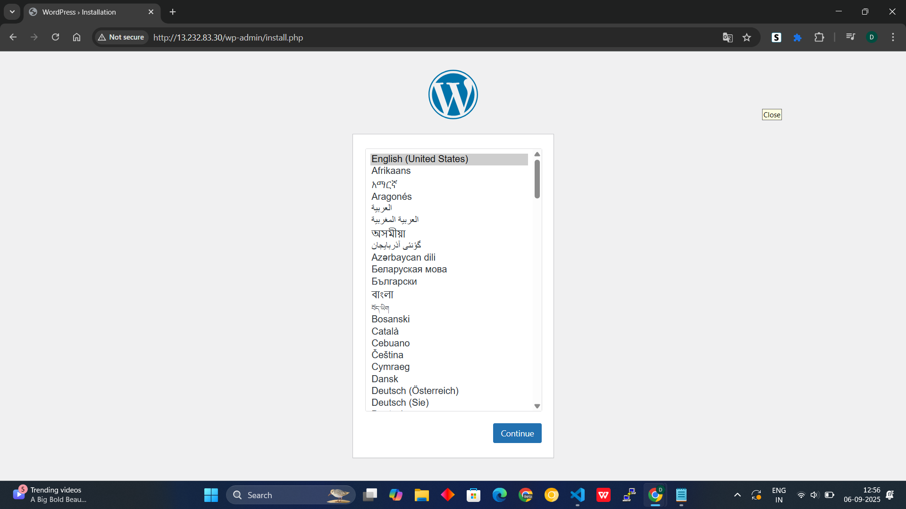

# 🚀 WordPress on AWS EC2 with RDS (MySQL) – Complete DevOps Guide

Deploy WordPress on AWS using:
- EC2 (Ubuntu 22.04)
- RDS (MySQL)
- Apache2 + PHP
- Secure SSH access

---

## 🏗️ Project Architecture

- **EC2**: Hosts WordPress frontend (Apache, PHP)
- **RDS**: Managed MySQL database
- **SSH**: Secured via `.pem` key
- **WordPress**: Connects to RDS endpoint

---

## 🛠️ Technologies Used

- AWS EC2 (Ubuntu 22.04)
- AWS RDS (MySQL, Free Tier)
- Apache2, PHP, MySQL Client
- WordPress CMS
- Git Bash (Windows SSH)

---

## 1️⃣ Create AWS EC2 Instance

1. **Login** to AWS Console.
2. Go to **EC2 > Instances > Launch Instance**.
3. **Name**: `wordpress-ec2`
4. **AMI**: Ubuntu Server 22.04 LTS (Free tier eligible)
5. **Instance type**: t2.micro (Free tier)
6. **Key pair**: Create/download `.pem` file (e.g., `jenkins.pem`)
7. **Security group**: Allow SSH (port 22), HTTP (port 80)
8. **Launch** the instance.

---

## 2️⃣ Create and Configure AWS RDS MySQL Database

1. Go to **RDS > Databases > Create database**.
2. **Easy Create** > **MySQL** > Free tier
3. **DB identifier**: `wordpress`
4. **Master username**: `admin`
5. **Master password**: `YourPassword123`
6. **Security group**: Allow inbound MySQL (port 3306) from EC2’s security group.
7. Click **Create database**.

---

## 3️⃣ Connect EC2 to RDS

1. In RDS console, select your database.
2. Note the **endpoint** (e.g., `your-rds-endpoint.amazonaws.com`).
3. Ensure EC2 security group can access RDS (port 3306).

---

## 4️⃣ SSH into EC2 Instance

```bash
cd ~/Downloads
chmod 400 jenkins.pem
ssh -i jenkins.pem ubuntu@<EC2-PUBLIC-IP>
```

---

## 5️⃣ Install MySQL Client & Test RDS Connection

```bash
sudo apt update -y
sudo apt install mysql-client -y
mysql -h your-rds-endpoint.amazonaws.com -u admin -p
```

**Test queries:**
```sql
show databases;
create database wordpress;
```

---

## 6️⃣ Install Apache, PHP, and WordPress

```bash
sudo apt install apache2 php php-mysql libapache2-mod-php wget unzip -y
cd /tmp
wget https://wordpress.org/latest.tar.gz
tar -xvzf latest.tar.gz
sudo mv wordpress /var/www/html/
sudo chown -R www-data:www-data /var/www/html/wordpress
```

---

## 7️⃣ Configure Apache for WordPress

```bash
sudo nano /etc/apache2/sites-available/wordpress.conf
```

Paste:
```apache
<VirtualHost *:80>
    DocumentRoot /var/www/html/wordpress
    <Directory /var/www/html/wordpress>
        AllowOverride All
        Require all granted
    </Directory>
</VirtualHost>
```

Enable site & reload Apache:
```bash
sudo a2ensite wordpress
sudo a2dissite 000-default
sudo systemctl reload apache2
```

---

## 8️⃣ Configure WordPress to Use RDS

```bash
cd /var/www/html/wordpress
cp wp-config-sample.php wp-config.php
sudo nano wp-config.php
```

Set database details:
```php
define( 'DB_NAME', 'wordpress' );
define( 'DB_USER', 'admin' );
define( 'DB_PASSWORD', 'YourPassword123' );
define( 'DB_HOST', 'your-rds-endpoint.amazonaws.com' );
```

Restart Apache:
```bash
sudo systemctl restart apache2
```

---

## 9️⃣ Access Your WordPress Site

Open your browser:  
`http://<EC2-PUBLIC-IP>`

---

**🎉 Your WordPress site is now running on EC2 with a managed MySQL database on AWS RDS!**

